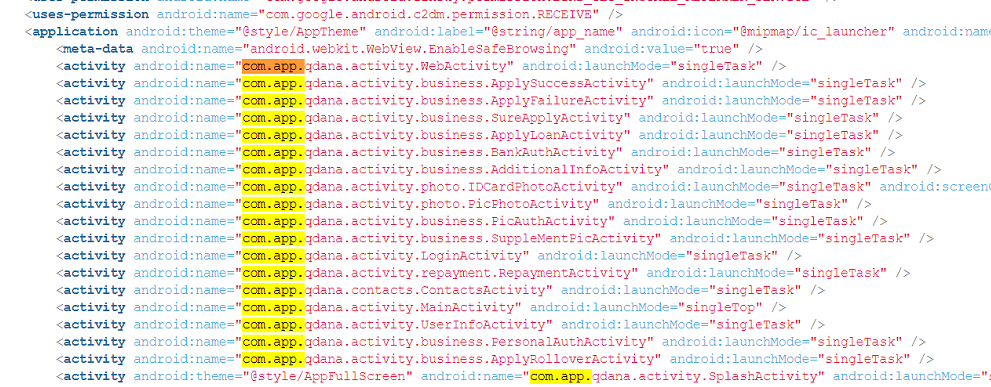
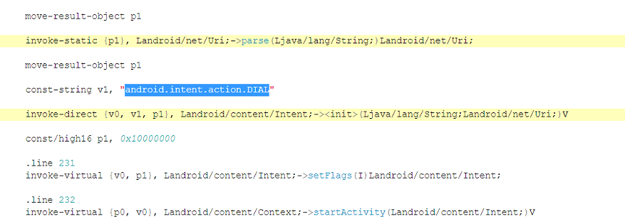

# Banyak Duit - 1.1.0.0111

yo what the hell with that version lol

source :  https://play.google.com/store/apps/details?id=com.app.banyakduit&hl=en&gl=US

## Summary

    

1. The application is using base code of other application its qdana another loan application, its like this application a clone from other application
2. The permission is so dangerous, detect your current LIVE location, the application can turn on or off your internet (mobile or wifi), the application can install other application, the application can read all your SMS and contact, the application can make a dial and the application can check your latest phone call

## Permissions

1. Location (android.permission.ACCESS_COARSE_LOCATION, android.permission.ACCESS_FINE_LOCATION)

  > tl;dr application can get the live current device location

2. Networking (android.permission.ACCESS_NETWORK_STATE, android.permission.ACCESS_WIFI_STATE, android.permission.CHANGE_NETWORK_STATE, android.permission.CHANGE_WIFI_STATE, android.permission.INTERNET)

  > tl;dr the application can connect or disconnect from the mobile network or wifi and access the internet

3. Install Extra App (android.permission.BROADCAST_PACKAGE_ADDED, android.permission.BROADCAST_PACKAGE_CHANGED, android.permission.BROADCAST_PACKAGE_INSTALL, android.permission.BROADCAST_PACKAGE_REPLACED, android.permission.REQUEST_INSTALL_PACKAGES)

   > the application can install an extra application (malware, etc)

   > permission `BROADCAST_PACKAGE_*` used for update itself

5. Process (android.permission.FOREGROUND_SERVICE)

  > tl;dr the application show at the status bar notification

6. External storage access(android.permission.MOUNT_UNMOUNT_FILESYSTEMS, android.permission.READ_EXTERNAL_STORAGE, android.permission.WRITE_EXTERNAL_STORAGE)

  > tl;dr used by application to check if the removable storage is available, if available then mount and read

4. Camera (android.permission.CAMERA, android.permission.CAMERA.AUTOFOCUS)

  > tl;dr application access camera and autofocus

7. Contact (android.permission.READ_CONTACTS)

  > tl;dr real all of your contact on phone, may read all of your SMS too

8. Activity (android.permission.READ_PHONE_STATE)

  > tl;dr application understand the activities of call (read phone state and identity), for example to get the IMEI system

9. Startup (android.permission.RECEIVE_BOOT_COMPLETED)

  > tl;dr the application will run by it self when the device is complettelly rebooted

10. Vibrator (android.permission.VIBRATE, android.permission.WAKE_LOCK)

  > tl;dr vibrate your phone

11. Read System Setting (com.android.launcher.permission.READ_SETTINGS)

  > tl;dr the application can check all of the system setting

12. Notification (com.google.android.c2dm.permission.RECEIVE, com.google.android.finsky.permission.BIND_GET_INSTALL_REFERRER_SERVICE)

  > tl;dr applicatio just sent the notification

## Unique Behaviour

1. Activity Application from `com.app.qdana`, are they just using the same base code ?

2. Application can dial phone

