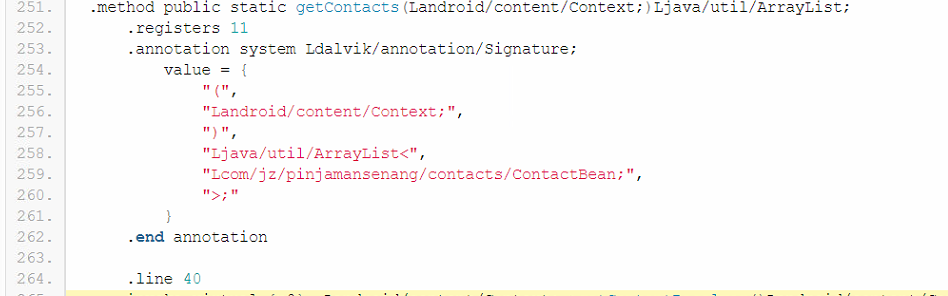
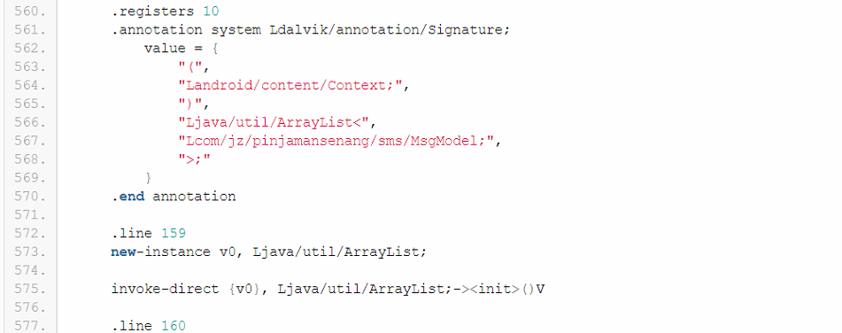
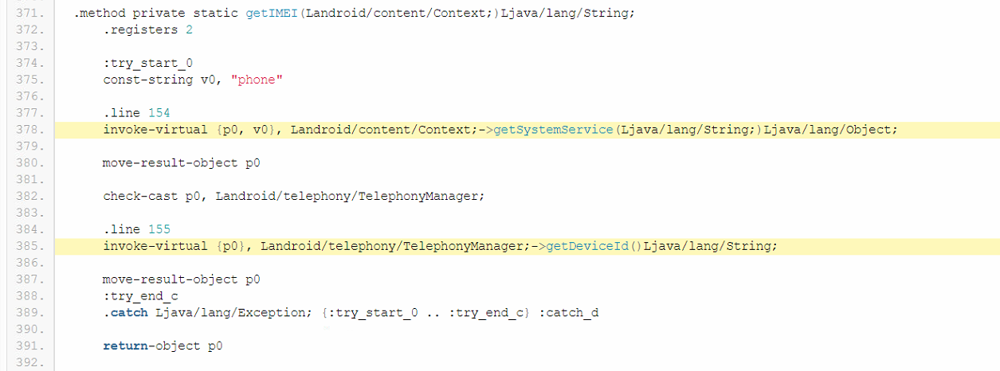
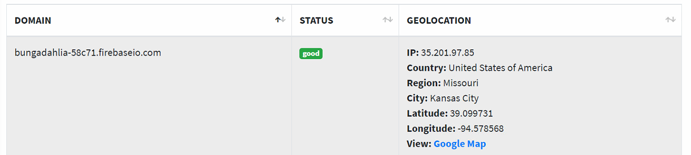

# 2.1.0.0324

source : https://play.google.com/store/apps/details?id=com.jzbmi.bungadahlia

## Summary

1. The permission is so dangerous, detect your current LIVE location, the application can turn on or off your internet (mobile or wifi), the application can install other application, the application can read all your SMS and contact, the application can make a dial and the application can check your latest phone call
2. 

## Permissions

1. Location (android.permission.ACCESS_COARSE_LOCATION, android.permission.ACCESS_FINE_LOCATION)

   > tl;dr application can get the live current device location

2. Networking (android.permission.ACCESS_NETWORK_STATE, android.permission.ACCESS_WIFI_STATE, android.permission.CHANGE_NETWORK_STATE, android.permission.CHANGE_WIFI_STATE, android.permission.INTERNET)

  > the application can connect or disconnect from the mobile network or wifi

3. Install Extra App (android.permission.BROADCAST_PACKAGE_ADDED, android.permission.BROADCAST_PACKAGE_CHANGED, android.permission.BROADCAST_PACKAGE_INSTALL, android.permission.BROADCAST_PACKAGE_REPLACED, android.permission.REQUEST_INSTALL_PACKAGES)

   > the application can install an extra application (malware, etc)

   > permission `BROADCAST_PACKAGE_*` used for update itself

4. Camera (android.permission.CAMERA, android.permission.CAMERA.AUTOFOCUS)
5. Process (android.permission.FOREGROUND_SERVICE)

   > tl;dr the application show at the status bar notification

6. external storage(android.permission.MOUNT_UNMOUNT_FILESYSTEMS, android.permission.READ_EXTERNAL_STORAGE, android.permission.WRITE_EXTERNAL_STORAGE)

   > used by application to check if the removable storage is available, if available then mount and read

7. Contact (android.permission.READ_CONTACTS)
   > tl;dr real all of your contact on phone, may read all of your SMS too

   

   > read all of your SMS on phone

   

8. Activity (android.permission.READ_PHONE_STATE)

    > application understand the activities of call (read phone state and identity), for example to get the IMEI system

   > get the IMEI system

   

9. Startup (android.permission.RECEIVE_BOOT_COMPLETED)
10. Vibrator (android.permission.VIBRATE, android.permission.WAKE_LOCK)
11. Read System Setting (com.android.launcher.permission.READ_SETTINGS)
12. Notification (com.google.android.c2dm.permission.RECEIVE, com.google.android.finsky.permission.BIND_GET_INSTALL_REFERRER_SERVICE)

this application require the KYC, with more detail KYC, from family city until work license

## Asumption

- identity card stored at indonesia server 

350722420989002

https://ind-loan.oss-ap-southeast-5.aliyuncs.com

http://47.98.136.146